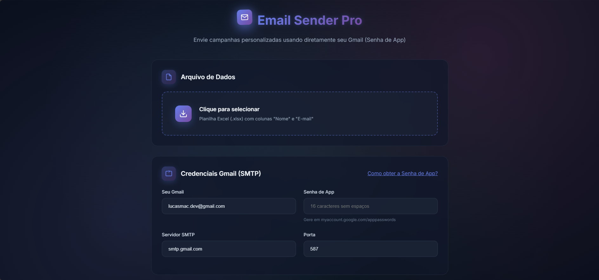

<!-- PORTFOLIO-FEATURED
title: Email Sender Pro
description: Ferramenta web para envio de e-mails em massa de forma simples e eficiente, com suporte a personalização via planilha e integração com Gmail.
technologies: Python, Flask, HTML5, CSS3, JavaScript
demo: https://email-sender-pro.vercel.app/
highlight: true
image: foto.png
-->

<p align="center">
  
</p>

# 📨 Email Sender Pro

Ferramenta web para envio de e-mails em massa de forma simples e eficiente. Desenvolvida para facilitar o disparo de comunicações personalizadas para listas de contatos.

## 🔧 Correções de Compatibilidade com Vercel

Foram implementadas as seguintes correções para resolver problemas de compatibilidade com o ambiente Vercel:

1. **Configuração de CORS**: Adicionados cabeçalhos CORS específicos no `vercel.json` e manipuladores de requisições OPTIONS no `app.py` para garantir que as requisições cross-origin funcionem corretamente.

2. **Rotas Estáticas**: Configuração de rotas no `vercel.json` para servir corretamente os arquivos estáticos da pasta `web/`.

3. **Tratamento de Erros**: Melhorado o tratamento do erro "Failed to fetch" no frontend para fornecer mensagens mais claras aos usuários.

4. **Configuração da API**: Ajustada a configuração da API_BASE no frontend para funcionar em diferentes ambientes (desenvolvimento local na porta 5500, servidor local na porta 8000 e Vercel).

5. **Suporte a Métodos HTTP**: Adicionado suporte explícito ao método OPTIONS no endpoint `/api/send` para resolver o erro 405 (Method Not Allowed) em requisições cross-origin.

6. **Correção do Erro FUNCTION_INVOCATION_FAILED**: Implementada solução para o erro de invocação de função na Vercel, ajustando o handler no arquivo `api/index.py` para processar corretamente o formato de entrada e saída esperado pela plataforma e adicionando dependências ausentes no arquivo `requirements.txt`. Para mais detalhes, consulte o arquivo [VERCEL_TROUBLESHOOTING.md](VERCEL_TROUBLESHOOTING.md).

## 🚀 Primeiros Passos

### Pré-requisitos
- Python 3.9 ou superior
- Conta no Gmail com autenticação em duas etapas ativada
- Pacotes listados em `requirements.txt`

### Instalação Local

1. Clone o repositório:
   ```bash
   git clone https://github.com/seu-usuario/email-sender-pro.git
   cd email-sender-pro
   ```

2. Crie e ative um ambiente virtual:
   ```bash
   python -m venv venv
   source venv/bin/activate  # Linux/Mac
   .\venv\Scripts\activate  # Windows
   ```

3. Instale as dependências:
   ```bash
   pip install -r requirements.txt
   ```

4. Execute a aplicação:
   ```bash
   python app.py
   ```
   Acesse: http://localhost:8000

## 📝 Como Usar

### Estrutura da Planilha
Crie um arquivo Excel (.xlsx) com pelo menos as colunas:
- `Nome`: Nome do destinatário
- `E-mail`: Endereço de e-mail

Exemplo:

| Nome         | E-mail             |
|--------------|-------------------|
| João Silva   | joao@email.com    |
| Maria Santos | maria@email.com   |

### Configuração do Gmail

1. **Ative a autenticação em duas etapas**
   - Acesse: [Conta Google](https://myaccount.google.com/security)
   - Ative a verificação em duas etapas

2. **Gere uma senha de app**
   - Acesse: [Senhas de App](https://myaccount.google.com/apppasswords)
   - Selecione "Mail" e "Outro (personalizado)"
   - Digite um nome (ex: "Email Sender")
   - Clique em "Gerar" e copie a senha de 16 caracteres

3. **Preencha no formulário (SMTP Gmail)**
   - Seu Gmail (smtp_user): seuemail@gmail.com
   - Senha de App (smtp_pass): senha de 16 caracteres
   - Servidor (smtp_server): `smtp.gmail.com`
   - Porta (smtp_port): `587`

### Enviando E-mails

1. **Preparação**
   - Acesse a interface web
   - Faça upload da planilha de contatos
   - Preencha as credenciais do Gmail

2. **Personalização**
   Use variáveis no corpo da mensagem:
   ```
   Olá {nome},
   
   Seu endereço de e-mail é: {email}
   
   Atenciosamente,
   Equipe
   ```

3. **Envio**
   - Revise as configurações
   - Clique em "Enviar"
   - Acompanhe o progresso na tela
   - Observação (Vercel produção): uma chamada envia até 5 emails (proteção contra timeout). Para mais envios, repita o processo.

## 🛠️ Desenvolvimento

### Estrutura do Projeto

```
email-sender-pro/
├── api/               # Endpoints da API
├── src/              # Código-fonte Python
├── web/              # Arquivos estáticos (HTML, CSS, JS)
├── app.py           # Aplicação principal
├── requirements.txt  # Dependências
└── vercel.json      # Configuração do Vercel
```

### Otimizações para Vercel

O projeto foi otimizado para funcionar em ambiente serverless da Vercel:

- Tempo máximo de execução aumentado para 300 segundos (5 minutos)
- Limite configurável de emails por requisição (padrão: 5)
- Remoção de esperas entre envios em ambiente serverless
- Interface adaptada para informar sobre as limitações
- Variável de ambiente `VERCEL_EMAIL_LIMIT` para ajustar o limite de emails

### Deploy no Vercel

1. **Crie uma conta na Vercel**
   - Acesse [vercel.com](https://vercel.com) e crie uma conta ou faça login

2. **Conecte seu repositório**
   - Importe o projeto do GitHub, GitLab ou Bitbucket
   - Ou use o Vercel CLI para deploy direto

3. **Configure as variáveis de ambiente**
   - No dashboard da Vercel, vá para seu projeto > Settings > Environment Variables
   - Adicione as mesmas variáveis do arquivo `.env.example`
   - Não é necessário adicionar `FLASK_ENV` ou `DEBUG_SMTP` em produção

4. **Configurações de build**
   - Framework Preset: Other
   - Build Command: `pip install -r requirements.txt`
   - Output Directory: Deixe em branco
   - Install Command: Deixe em branco

5. **Deploy**
   - Clique em "Deploy" e aguarde a conclusão
   - O Vercel usará automaticamente o arquivo `vercel.json` para configurar o projeto

### Troubleshooting Vercel Deployment

Se encontrar falhas no deploy, tente estas soluções:

1. **Verifique os logs de build**: Revise os logs para identificar mensagens de erro específicas.

2. **Versão do Python**: Certifique-se que o arquivo `runtime.txt` contém `python-3.9` (não apenas `3.9`).

3. **Compatibilidade de pacotes**: Verifique se todos os pacotes em `requirements.txt` são compatíveis com Python 3.9.

4. **Configuração de build**: Use o script `build.sh` fornecido que configura corretamente a estrutura de diretórios de saída do Vercel.

5. **Estrutura de arquivos**: Garanta que seu projeto segue a estrutura esperada com `api/index.py` como ponto de entrada da função serverless.

6. **Conflitos de configuração**: O Vercel não permite usar as propriedades `builds` e `functions` juntas no mesmo arquivo de configuração. Use a propriedade `config` dentro de cada build para definir configurações específicas:
   ```json
   {
     "builds": [
       {
         "src": "api/index.py",
         "use": "@vercel/python",
         "config": {
           "maxDuration": 300
         }
       }
     ]
   }
   ```

7. **Deploy manual**: Tente usar o Vercel CLI com:
   ```
   vercel --prod
   ```

8. **Sobrescrever configuração**: Se tudo falhar, use o diretório `.vercel` fornecido neste repositório que contém uma estrutura de saída pré-configurada.

### Variáveis de Ambiente

Crie um arquivo `.env` na raiz do projeto:

```env
FLASK_ENV=development
SECRET_KEY=sua_chave_secreta_aqui
VERCEL_EMAIL_LIMIT=5  # Limite de emails por requisição na Vercel
```

## 🔒 Segurança

- As credenciais de e-mail nunca são armazenadas
- Conexões SMTP usam TLS por padrão
- Recomenda-se usar uma conta dedicada para envio de e-mails

## ⚠️ Limitações

- Limite de 100 e-mails por dia (limitação do Gmail)
- Em produção (Vercel), cada requisição envia até 5 emails para evitar timeouts
- O tempo máximo de execução na Vercel foi configurado para 300 segundos (5 minutos)
- Tamanho máximo de anexo: 25MB
- Recomenda-se testar com uma pequena lista antes de disparar para muitos contatos

## 📄 Licença

Este projeto está licenciado sob a licença MIT - veja o arquivo [LICENSE](LICENSE) para detalhes.

## 🙋‍♂️ Suporte

Encontrou um problema ou tem sugestões? Por favor, abra uma issue no repositório.

---

Desenvolvido com ❤️ por Lucas Andrade

**Erro de Autenticação**
- Use Senha de App, não a senha normal
- Verifique se 2FA está ativo

**Emails não chegam**
- Verifique pasta de spam
- Teste com poucos destinatários primeiro

**Erro de Conexão**
- Verifique internet
- Alguns provedores bloqueiam SMTP

## 📄 Licença

Projeto de uso educacional e pessoal.

---

**⚠️ Uso Responsável**: Use apenas com listas próprias e consentimento dos destinatários. Respeite LGPD/GDPR.